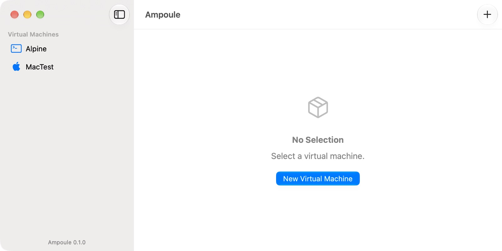
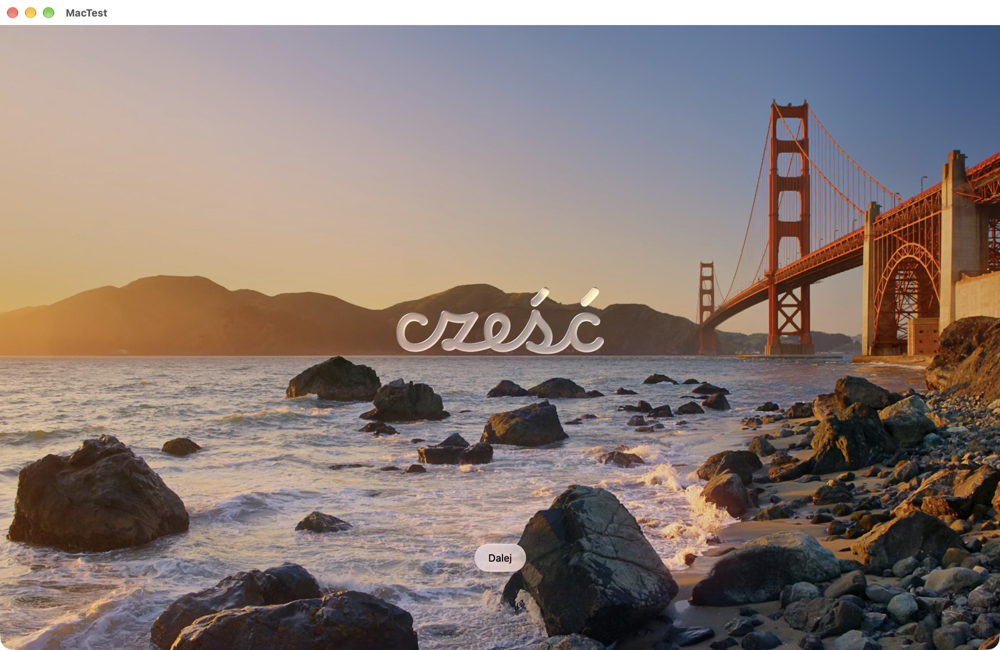
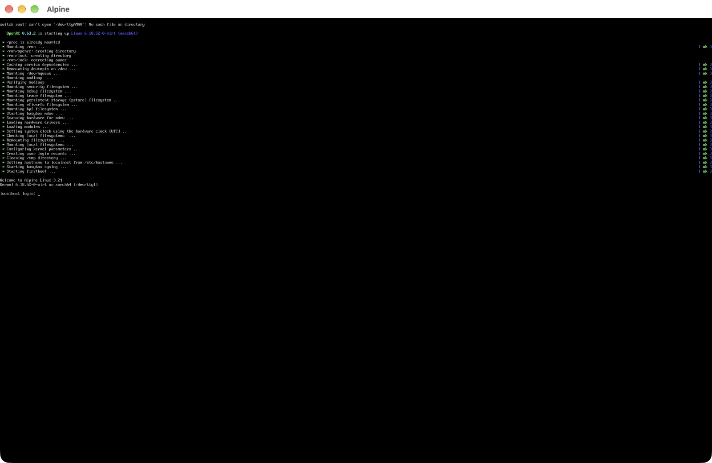

# Ampoule

An open-source virtual machine app for Apple Silicon Macs. Run macOS and Linux guests in a native SwiftUI app with Liquid Glass, or from the command line. Windows 11 support is planned through Ampoule's own VM engine.

> **Status: v0.1, early.** macOS and Linux guests work through Apple's Virtualization.framework. There are no signed downloads yet: build from source. See [Limitations](#limitations) and the [roadmap](docs/DESIGN.md#roadmap-68-hweek).



| macOS 27 guest | Linux guest (Alpine 3.24) |
|---|---|
|  |  |

## Features

- **macOS guests**, installed from Apple's restore image. `--ipsw latest` downloads the newest version your Mac supports and caches it for later VMs.
- **Linux guests** (ARM64), booted from any installer ISO.
- **Shared folders.** macOS guests see them in `/Volumes/My Shared Files`; Linux guests mount them with virtiofs.
- **A Mac app** with a VM library, background macOS installs with progress, and VM windows that keep running when closed.
- **An `ampoule` CLI** for scripting: `create`, `run`, `list`, `share`, `validate`, `ipsw`.
- **Safe by default.** VMs are created all-or-nothing, a VM can't be started twice, settings can't change while it runs, and damaged files are reported instead of silently replaced.

What Ampoule won't do is listed under [Non-goals](docs/DESIGN.md#non-goals-d17).

## Trying it

```bash
ampoule create Ubuntu --os linux --disk 64
ampoule run Ubuntu --iso ~/Downloads/ubuntu-server-arm64.iso   # install from an ARM64 ISO
ampoule run Ubuntu                                             # later boots
ampoule list

ampoule ipsw                                                   # newest macOS this Mac can run
ampoule create MyMac --os macos --ipsw latest                  # download (~27 GB, cached) and install
ampoule run MyMac

ampoule share add Ubuntu ~/Projects                            # Linux: mount -t virtiofs ampoule /mnt/shared
ampoule share add MyMac ~/Notes --read-only                    # macOS: /Volumes/My Shared Files
```

Closing a VM window or pressing Control-C asks the guest to shut down; doing it again forces it off. VMs live in `~/Library/Application Support/Ampoule/VMs` (override with `$AMPOULE_HOME`).

## Building from source

Requirements: an Apple Silicon Mac, macOS 26 or later, Xcode 26 or later. Rust (via [rustup](https://rustup.rs)) for the engine.

```bash
scripts/build-cli.sh            # builds and signs the ampoule CLI, prints its path
swift test                      # unit tests
scripts/smoke-test.sh           # boots a throwaway VM end to end
xcodebuild -project Ampoule.xcodeproj -scheme Ampoule build
cd engine && cargo test         # ampoule-engine (placeholder until milestone E1)
```

Virtualization.framework only runs VMs from binaries signed with the virtualization entitlement; `scripts/build-cli.sh` and the Xcode project both sign locally (ad hoc).

## Limitations

- **No signed downloads.** Notarized builds come with 1.0 (decision [0007](docs/decisions/0007-distribution.md)).
- **No Windows yet.** Windows 11 needs Ampoule's own VM engine (decision [0006](docs/decisions/0006-own-vm-engine.md)); that work starts after v0.2.
- **VMs stop when the app quits.** Quitting asks guests to shut down first.
- **Not yet built:** snapshots, clipboard sharing, a guest agent, 3D graphics acceleration.
- **Less-tested paths:** the app's VM-creation sheet and VM window controls have been built and reviewed, but the end-to-end tests drive the CLI. See the [changelog](CHANGELOG.md) for what was verified.

## Architecture

```
Ampoule.app (SwiftUI)          ampoule (CLI)
         \                     /
          AmpouleAppModel (app state)
                   |
          AmpouleCore (bundle format, configuration, backend protocol)
         /                     \
  AmpouleVZ                     ampoule-engine (Rust, planned)
  Virtualization.framework      Hypervisor.framework
  (macOS, Linux)                (Windows, full-featured Linux)
```

Details: [docs/DESIGN.md](docs/DESIGN.md). Every decision has a record in [docs/decisions](docs/decisions/).

## How this was built

Ampoule is built by one independent developer working with AI coding agents (Claude). The split is deliberate and recorded:

- **The author** sets the direction and makes the product and architecture decisions: which guests to support, building an own VM engine instead of using QEMU, the license, the non-goals, and the testing standard. The author approves every merge.
- **AI agents** write most of the implementation, tests and first drafts of documentation, including the first drafts of the decision records. Their commits carry a `Co-Authored-By` trailer, so `git log` shows who wrote what.
- **In progress:** the author's own rationale for each [decision record](docs/decisions/), a [walkthrough](docs/walkthroughs/) of the v0.1 code, and the [AI review log](docs/ai-review/) of corrections to AI-written code.

## License

[Apache-2.0](LICENSE). Contributions are accepted under the [Developer Certificate of Origin](CONTRIBUTING.md#sign-off).
